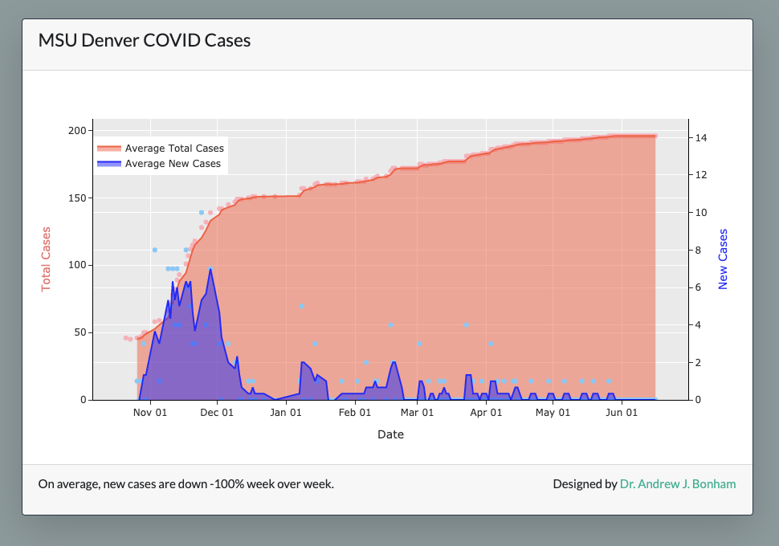

# msu-covid-tracker

  ⭐ &nbsp;&nbsp;the project to show your appreciation. :arrow_upper_right:

   

## Description

Collected daily [MSU Denver covid dashboard](https://www.msudenver.edu/safe-return-to-campus/) data and published it in a plotly dash dashboard at:

[https://msu-covid-tracker.herokuapp.com](https://msu-covid-tracker.herokuapp.com)

**Note:** As of June 1, 2021, the university updates have ended, so no new data is being collected.

## Workflow

This app relied on [Github actions](https://github.com/features/actions) to grab updated data and store in in an Amazon S3 Bucket. The app, dynamically hosted on heroku.com, then reads fresh data from S3.

## Authors

This script is developed as academic software by [Dr. Andrew J. Bonham](https://github.com/Paradoxdruid) at the [Metropolitan State University of Denver](https://www.msudenver.edu). It is licensed under the GPL v3.0.
